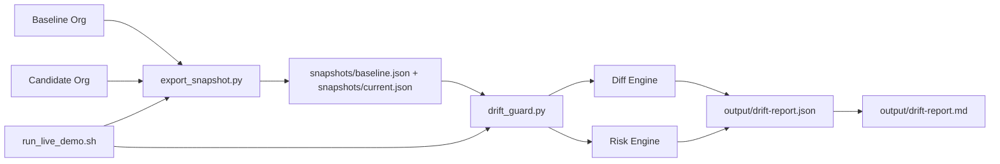

# Drift Report Architecture

## Goal

Detect configuration drift between a known-good baseline org and a candidate org, then produce release guidance with risk scoring and rollback steps.

## High-Level Flow

## Components

- `run_live_demo.sh`
  - Orchestrates end-to-end run (export baseline, export candidate, generate report).
- `export_snapshot.py`
  - Fetches selected config signals from a Salesforce org using `sf data query`.
  - Normalizes them into project snapshot schema.
- `drift_guard.py`
  - Flattens snapshot structures.
  - Computes `added`, `removed`, `modified` drift items.
  - Applies rule-based risk classification (`high`, `medium`, `low`).
  - Generates JSON + markdown reports and rollback suggestions.

## Data Schema (Snapshot)

Each snapshot is a JSON object with sections such as:

- `features`
- `permissions`
- `sharing`
- `routing`
- `labels`

`drift_guard.py` is schema-flexible: any nested keys are flattened and compared.

## Risk Classification Rules (Current)

- `permissions.*` -> high
- `routing.*` -> high
- `sharing.*` -> high
- `features.gen_ai*` -> medium
- `features.*` -> medium
- `labels.*` -> low
- `descriptions.*` -> low
- everything else -> low

## Current Limitations

- Snapshot extraction intentionally covers a focused subset for fast demo.
- Some org queries may return empty results depending on enabled objects/features.
- No external notification channel wired yet (Slack/Jira/email are future additions).

## Next Extensions

- Add org-specific query profiles for broader metadata coverage.
- Add policy file support to override risk levels by key/path.
- Push report summary to Slack or CI status checks.
- Add historical run store for trend analytics.
