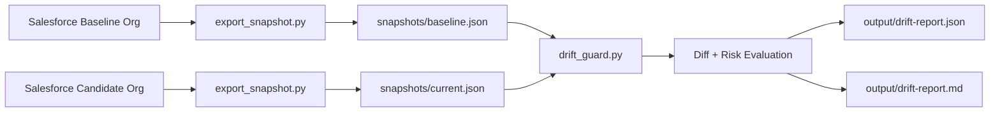
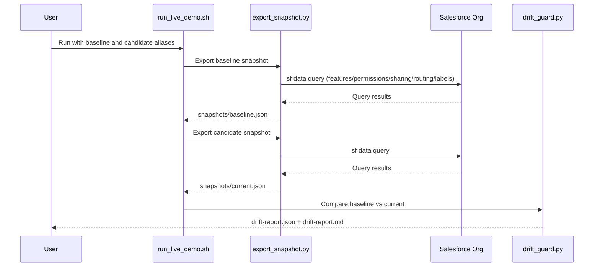

# Drift Report Architecture

## System intent

The system answers one release question:
**"Did this org/template drift from approved baseline in a risky way?"**

## End-to-end view

## Runtime sequence

## Components

- `run_live_demo.sh`
  - Orchestration layer.
  - Calls export twice (baseline, candidate), then compare/report.
- `export_snapshot.py`
  - Data collection layer.
  - Uses `sf data query` and converts raw query results to normalized snapshot keys.
- `drift_guard.py`
  - Analysis layer.
  - Computes drift, applies risk rules, generates reports and rollback actions.

## Snapshot contract

A snapshot is a nested JSON document. Core sections:

- `features`
- `permissions`
- `sharing`
- `routing`
- `labels`

Comparison engine is key-path based:
1. flatten nested JSON into `dot.path` keys,
2. compare key union across baseline/current,
3. classify each change as `added`, `removed`, or `modified`.

## Risk engine

Path-prefix rule evaluation:

- `permissions.*` -> high
- `routing.*` -> high
- `sharing.*` -> high
- `features.gen_ai*` -> medium
- `features.*` -> medium
- `labels.*` -> low
- `descriptions.*` -> low
- default -> low

The release gate is simple and explicit:
- if any `high` risk drift exists, `safe_to_promote = false`.

## Non-goals for current version

- Full metadata coverage for every Salesforce setup object.
- Background daemon for continuous monitoring.
- External notification delivery (Slack/Jira/email).

## Evolution path

1. Add policy file for custom risk mapping per key path.
2. Add notification adapters.
3. Add historical run storage for trend and audit.
4. Replace/augment CLI collection with MCP-backed collector.
