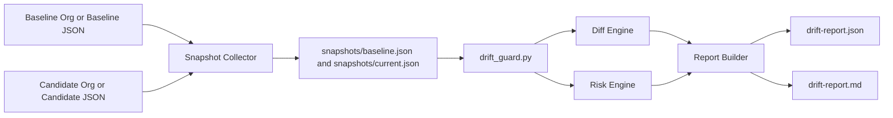
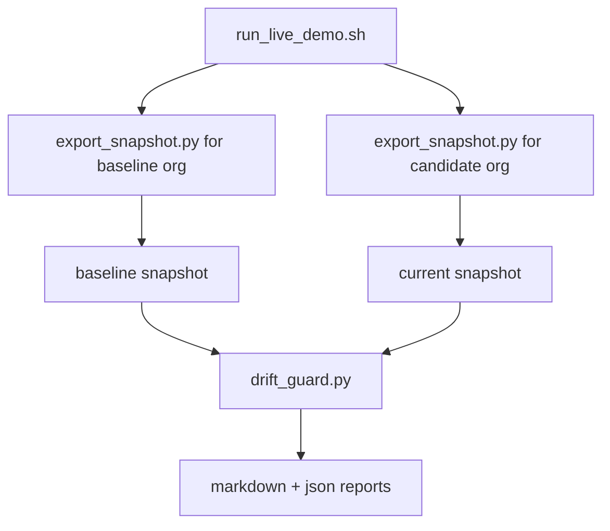

# Drift Report

Drift Report is a release-safety tool for Salesforce setup/configuration.

It compares a known-good **baseline** snapshot with a **candidate** snapshot, then tells you:
- what changed,
- how risky each change is,
- whether release should be blocked,
- and how to roll back.

## Why this exists

Shared orgs often drift between release cycles (permissions, sharing, routing, feature flags).  
This tool gives a fast, explainable report so teams can catch risky changes before go-live.

## Quick Start

### Option A: Snapshot demo (fastest and most reliable)

```bash
python3 drift_guard.py \
  --baseline snapshots/baseline.json \
  --current snapshots/current.json \
  --output output
```

Open `output/drift-report.md`.

### Option B: Live org demo (scripted extraction + report)

Prerequisites:
- Salesforce CLI installed (`sf`)
- Baseline and candidate orgs authenticated with aliases

Run:

```bash
./run_live_demo.sh <baseline_org_alias> <candidate_org_alias> [permission_set_label] [sharing_object] [queue_name] [label_name]
```

Example:

```bash
./run_live_demo.sh baseline candidate DriftDemo_Perms Contact "Support Queue" DRIFT_DEMO_LABEL
```

## What the tool outputs

- `output/drift-report.json` (machine-readable)
- `output/drift-report.md` (human-readable summary for demos/reviews)

Report includes:
- drift type: `added`, `removed`, `modified`
- risk level: `high`, `medium`, `low`
- release gate signal: `Safe to promote: YES/NO`
- rollback guidance per changed key

## Architecture





## Risk model (current rules)

- `permissions.*` -> high
- `routing.*` -> high
- `sharing.*` -> high
- `features.gen_ai*` -> medium
- `features.*` -> medium
- `labels.*` -> low
- `descriptions.*` -> low
- all other keys -> low

## Project structure

```text
.
├── drift_guard.py         # core compare + risk + reporting engine
├── export_snapshot.py     # Salesforce org -> normalized snapshot
├── run_live_demo.sh       # one-command export + compare workflow
├── snapshots/             # baseline/current input files
├── output/                # generated reports (gitignored)
├── ARCHITECTURE.md        # deeper design notes
└── DEMO_READY.md          # demo runbook and talking points
```

## What `export_snapshot.py` reads today

- `features`: org-level Einstein analytics + sandbox flag
- `permissions`: selected object permissions from one permission set label
- `sharing`: sharing model for one object
- `routing`: queue presence/name/dev name
- `labels`: one custom label value

If a query does not match your org setup, the script continues and writes default/empty values for that section.

## Troubleshooting

- **`LightningDomain` error during login**  
  Use `sf org login web --instance-url https://test.salesforce.com --alias <alias>`.
- **No data for a section**  
  Check the input names (`permission_set_label`, queue name, label name, object API name).
- **Report says no drift**  
  Confirm baseline and current are from different states/orgs.

## Demo runbook

Use `DEMO_READY.md` for a 3-5 minute video/demo sequence.

## Next improvements

- Policy file for custom risk rules
- Slack/Jira notifications
- Historical runs and trend view
- MCP collector integration for enterprise workflows
